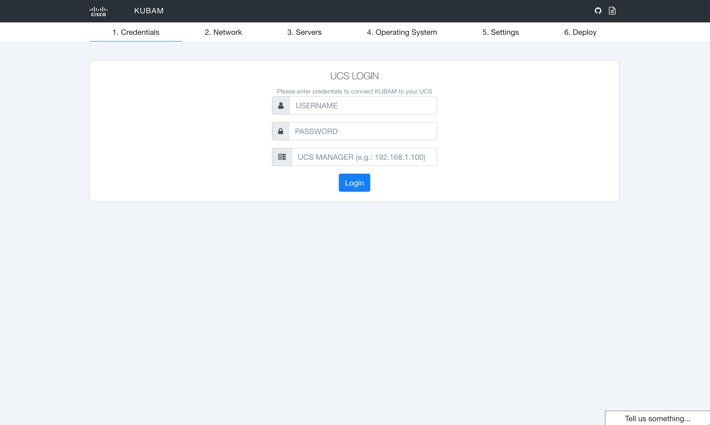
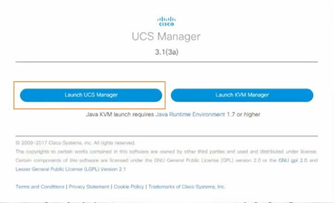
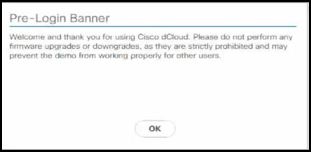
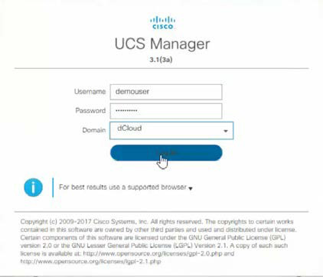
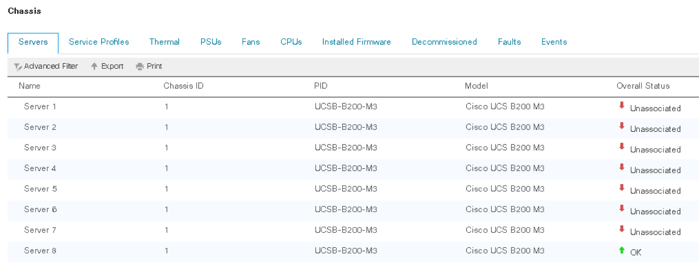

# KUBAM Installation Lab

The purpose of this module is to show how quickly and efficiently you can install KUBAM. It’s so easy it will be something you’ll want to do on a Friday night just for fun.  

We first install [Docker](https://docker.com) and then [Docker Compose](https://docs.docker.com/compose/).  From there we only need two commands and KUBAM is up and ready for us to use.  So simple it’s scary.  Easiest install you’ll ever do.  For the bulk of this lab you will be just waiting and twiddling your thumbs.
 
KUBAM creates the necessary components needed to install a Kubernetes cluster on UCS bare metal from scratch.  One of the huge advantages of UCS and KUBAM is that a PXE server is not required to do automated operating system (OS) installations.  No external agent, just KUBAM to do all the work.  

Additionally, the goal of this exercise is to also be exposed to some of the DevOps tools commonly used. In this this scenario we will use Docker and Docker Compose.

## 1.1 Log in to KUBAM server

After connecting to the VPN you should now use a terminal (or Putty for Windows ) to connect to the KUBAM server.  This server is called ```utility1``` and the IP address is ```198.18.134.242```.  The user is ```root``` and password is ```C1sco12345```

```
ssh root@198.18.134.242
[root@razor1 ~]#
```
## 1.2 Install Prerequisites

The prereqs for KUBAM are docker and docker compose.  Perform the following on the utility1 server.  

### 1.2.1 Install Docker

First, check if docker is installed: 

```
docker ps
```

If you get no errors, go to step 1.2.2

No docker?  No problem.  Run the following.  Note:  Some of these commands you may not be able to copy and paste but may have to type out.  Try to copy and paste and if it fails try typing it out. 

Install Yum-Utils to be able to add another repo:

```
yum install -y yum-utils
```
Install the Docker repository

```
yum-config-manager --add-repo https://download.docker.com/linux/centos/docker-ce.repo
```

Remove existing docker

```
yum remove docker-common docker-client
```
(If that command fails, don't worry about it and go to next step)

Install Docker

```
yum install -y docker-ce
```

Enable Docker

```
systemctl start docker
systemctl enable docker
```
So easy. 

### 1.2.2 Install Docker Compose

Make sure docker is running:

```
systemctl start docker
systemctl enable docker
```


Next install Docker Compose.  Docker Compose provides a simple way to bring up multiple containers at the same time.  Since KUBAM is based on two containers that work together we simplify the installation using Docker Compose.  Perform the following on the utility1 server:

```
curl -L https://github.com/docker/compose/releases/download/1.17.0/docker-compose-Linux-x86_64 \
		  -o /usr/local/bin/docker-compose
```

Now make it executable:

```
chmod +x /usr/local/bin/docker-compose
```

Notice the above are just two commands. This grabs the correct compose version from github and then makes it an executable on our system.  Now we have docker and docker compose.  Super simple.  

What could go wrong?  Well, if you had a system that already had docker installed these instructions may not work.  Notice that we aren’t using the docker that comes default with the operating system.  So if that were installed you would uninstall it first.  Also if SELinux is enabled that is going to be a problem.  For now we ignore the problem by __making sure selinux is inactive__.  This server already has it disabled so we are good to go for the next step.  

## 1.3 Install KUBAM

To install KUBAM we need to grab the docker compose file.  Run the following on the utility1 server to grab the compose file: 

```
cd ~/
curl -O https://raw.githubusercontent.com/CiscoUcs/KUBaM/master/docker-compose.yml 
```
This will download the compose file (called ```docker-compose.yml```) that will be used to bring everything up.  Now run: 

```
docker-compose up -d
```
The ```-d``` flag makes it so these containers run in the background. 

This command will take a few minutes but at the end two containers will be up.  When the command finishes run: 

```
docker ps
```

This should give you output like:

```
[root@razor1 ~]# docker ps
CONTAINER ID        IMAGE               COMMAND                  CREATED             STATUS              PORTS                    NAMES
5966480b5461        kubam/web           "/bin/sh -c 'serve..."   4 minutes ago       Up 4 minutes        0.0.0.0:5000->5000/tcp   root_web_1
945d505417b5        kubam/kubam         "/bin/bash /usr/bi..."   4 minutes ago       Up 4 minutes        0.0.0.0:80->80/tcp       root_kubam_1
```

If you got this far, you are up!  Let's take a look at the kubam web interface.  

Navigate your web browser to [http://198.18.134.242:5000](http://198.18.134.242:5000) and behold the glory of KUBAM:



You'll notice the bottom right has an instant feedback button.  By clicking on it you can type whatever you want and that feedback will be placed in a spark room where kubam developers moderate feedback.  In the future we may add more two way communication but that is what is happening now. 

## 1.4 Open UCS

UCS in this lab can be accessed by opening the browser to [https://198.18.0.10/](https://198.18.0.10/)  Depending on the browser you may get an alert telling you the connection is not private.  In Chrome you can click on ADVANCED and it will allow you to proceed.  This warning is to tell you that there is no valid TLS certificate. 

### Launch UCS Manager



### Dismiss Prelogin Banner

Click OK to close the Pre-Login Banner, which cautions against firmware upgrades or downgrades in the demonstration environment.



### Login with the following credentials:

* Username: ```demouser```
* Password: ```C1sco12345```
* Domain: ```dCloud```



### Confirm blades 7 are unassociated

* In the Navigation pane, click __Equipment__ in the side menu.
* Click on the __Servers__ tab

Your output should look similar to below.  It may be that server 7 is associated.  That's ok, you'll just pick free blades to deploy with KUBAM. 



## Go to Next Lab

Nice work!  Now its time to configure KUBAM!  Let's go to the [next lab](./menus.md)

Or, you can go [back to the beginning](../README.md)


