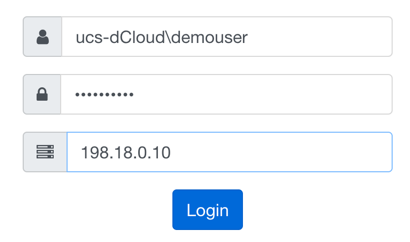
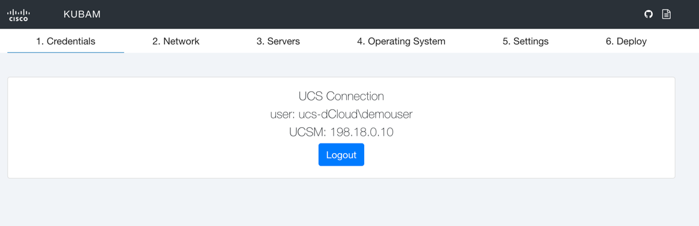
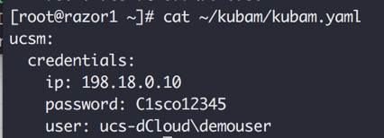
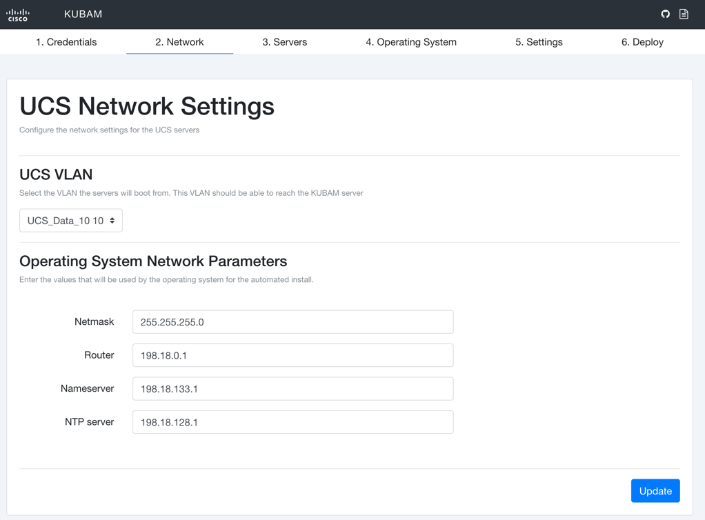
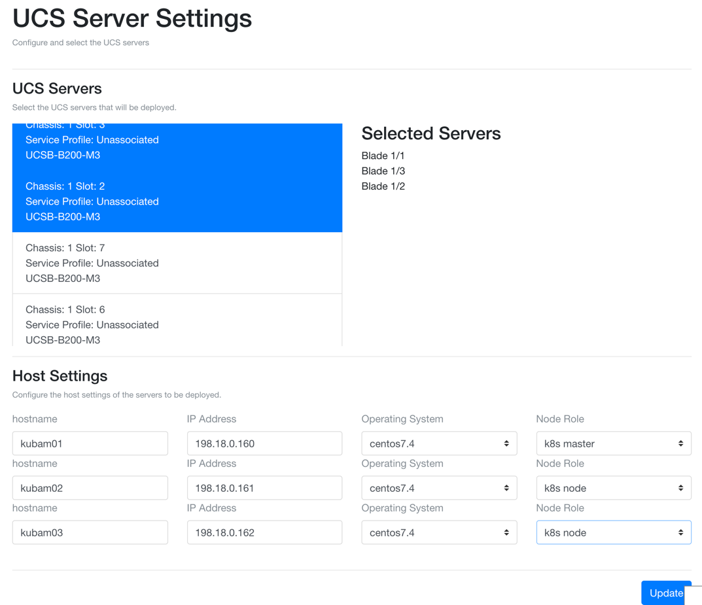
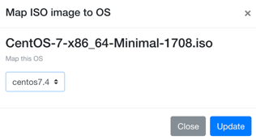
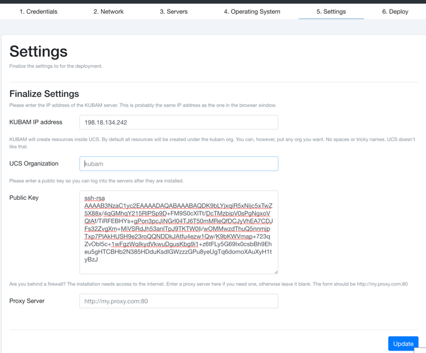
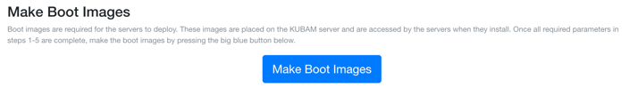
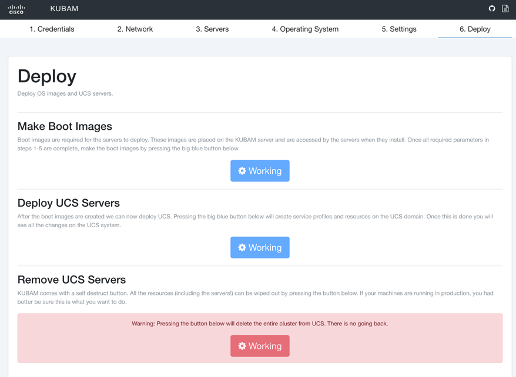
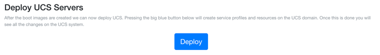

# KUBAM Configuration Lab

The purpose of this module is to walk through the different menus of KUBAM and configure our turn key Kubernetes environment.  The screens may change over time but the ideas of the parameters will be the same. 

Please make sure you [completed the previous lab](./install.md) before proceeding to this lab. 

## 1.1 Keys and ISOs

In order to walk through our configuration lab we need to first download an ISO image of CentOS 7.4 and generate SSH keys so we can log into the system. 

### 1.1.1 ISO image

This Operating System should be an ISO file and the ISO file should be placed in the KUBAM directory.  On the utility1 server run the following:

```
cd ~/kubam
wget http://mirror.cogentco.com/pub/linux/centos/7/isos/x86_64/CentOS-7-x86_64-Minimal-1708.iso 
```

This command should take a few minutes to grab the latest CentOS 7 ISO image.

### 1.1.2 Generate SSH Keys

On the utility1 server generate a private/public key pair using the following: 

```
ssh-keygen –t rsa # press Enter to accept all the defaults
cat ~/.ssh/id_rsa.pub 
```

Cool.  Now you have a key. You'll need this public key for a later menu. It should look something like this:

```
ssh-rsa AAAAB3NzaC1yc2EAAAADAQABAAABAQCsiAr+DrEydLL0FTpXMPc9F0f1kt+lRXCbhotA+bRBsXhwnanNL4un9WZsuKXpme/86D4xlvaxmby2Gv44kfxe5921EQTVkqLX3dVKEdvHSecczvVEuG+yJEZ0WxR8eP6ALpkp+Na8CF8M7Gvecdn/h7cdRjKj0511b1/S2rMARXKzBO5SEQCU0DDCVx9NnjpjCvcLvU38tRJtkR4L7t262BbMBp41yQxyZTasCXEG8wCYbdZT0wUmCfBOYmYMLfK7FzEWxsgApug7lnRqSIQgUcZjDiGuDm/lkqmffjF1aMUjzG63a0mgmNIMt0jQipRIXEXq1pKzxzxd4QL/zOJB root@razor1.dcloud.cisco.com
```

__DO NOT COPY AND PASTE THE ABOVE KEY EXAMPLE__ you will need your own key. 


## 1.2 Authenticate UCS with KUBAM

Now that we know how to get into UCS, we can go back to the KUBAM interface and login using the same credentials we did for the UCS web interface.  This will let KUBAM know about how to connect to UCS. Enter the UCS credentials in a slightly different way:

* User: __ucs-dCloud\demouser__
* Password: __C1sco12345__
* UCS: __198.18.0.10__
 


Once the authentication has succeeded you will see that KUBAM is logged in. 



KUBAM logins persist.  All the data that you enter is stored in ```~/kubam/kubam.yaml``` file on the KUBAM server (utility1).  You can go back to your terminal and see this file now.  You will see that as you enter fields into the GUI it is saved in the ```kubam.yaml``` file in YAML form.

This is great because it allows you to construct a ```kubam.yaml``` file before even seeing the system.  That way you can do a simple backup and restore without having to take time to fill out the form. 



## 1.3 Network Tab

Navigate to the Network panel in the KUBAM GUI and enter the following into the fields



*	Select __UCS_Data_10 10__ for the UCS VLAN
*	Netmask: __255.255.255.0__
*	Router: __198.18.0.1__
*	Nameserver: __198.18.133.1__
*	NTP server: __198.18.128.1__

Doublecheck that you entered those in correctly.  KUBAM can be unforgiving with mistakes.  

When finished __MAKE SURE TO PRESS THE UPDATE__ button on the bottom right to save your settings. This will update the ```kubam.yaml``` file as already discussed and persist in the GUI. 

## 1.4 Servers Tab

Navigate to the Servers step and select the servers from the list of UCS Servers.  

* Select any 3 servers that are __Unassociated__
* Enter the __IP__ and __hostname__ settings as shown below.  Also be sure to select __CentOS 7.4__.
* One of the nodes should be the K8s Master and the other two nodes be the worker nodes
* Notice that KUBAM will try to auto-populate for you the values starting from the top down. KUBAM is so clever!

 


When finished __MAKE SURE TO PRESS THE UPDATE__ button on the bottom right to save your settings. This will update the ```kubam.yaml``` file as already discussed and persist in the GUI. 

## 1.5 Operating System Tab

Navigate to the Operating System tab in KUBAM and Map an ISO Image 

 


In the popup select the ISO image and then map the ISO image to CentOS 7.4


Selecting the ISO image brings you to the map screen where you select 7.4 and __Update__ 



## 1.6 Settings Tab 

The Settings form allows us to enter in the final paramaters needed for KUBAM.  

Let's walk through this menu:



* KUBAM IP address:  __198.18.134.242__
* UCS Organization:  kubam or leave blank, or specify a UCS Org you want.  (No spaces or strange characters allowed.  The default is kubam)
* Public Key: Enter your key (without the hostname, more on this below)
* Proxy Server:  Leave blank.  dCloud doesn't need proxy to access the Internet but your own lab might!  If you were in a Cisco network you might use the proxy.esl domain.  

The hardest part here is the key.  Remember that key you generated way back in the beginning of this lab in step 1.1.2?  Well now we need to enter it in.  You can get the key again by running:

```
cat ~/.ssh/id_rsa.pub 
```

You'll notice it has a suffix part like ```root@razor1.dcloud.cisco.com```.  You'll have to cut that part out and then copy it and save.  This can be the hardest part of the whole lab.  If you get this, you are pretty amazing and KUBAM salutes you. 
  
When finished __MAKE SURE TO PRESS THE UPDATE__ button on the bottom right to save your settings. This will update the ```kubam.yaml``` file as already discussed and persist in the GUI.  If there were errors in the SSH key the GUI will let you know.  Check the format and ask questions if you need help. 

# 1.7 Deploy 

We have now reached the grand conclusion.  Navigate to __Deploy__ and select __Make Boot Images__.  This will build the necessary ISO images for installation.  When pressed you will see that everything goes to __Working__ as shown below





Finally, press __Deploy__ and kick everything off.  This build phase should take around 15-20 mins.  When done you’ll be able to log into your servers and run kubernetes commands. 



Log into the UCS and notice that three service profiles were created and they are configuring.  They may show errors initially but they should clear out and in several minutes you’ll see the servers associate.  The servers will automatically install and provision Kubernetes. 

# 1.8 Enter Host information

While the machines are installing log into the utility1 server and add the three nodes to the ```/etc/hosts``` file.

```
127.0.0.1   localhost localhost.localdomain localhost4 localhost4.localdomain4
::1         localhost localhost.localdomain localhost6 localhost6.localdomain6
198.18.0.160 kubam01
198.18.0.161 kubam02
198.18.0.162 kubam03
```

When the installation is finished, from the utility1 server you should be able to run ```ssh kubam01``` and not be prompted for a password.


# Go to Next Lab

Nice work!  Now while its installing, let's get familiar with what is happening and how to troubleshoot when things go wrong.  Let's do [The Troubleshooting Lab](./trouble.md) 

Or, you can go [back to the beginning](../README.md)


