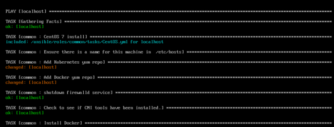
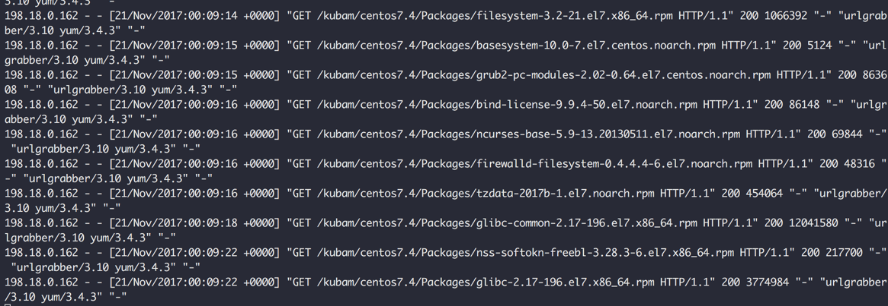
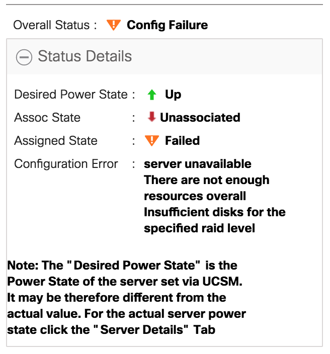
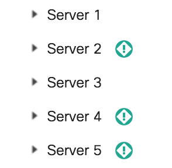

# KUBAM Troubleshooting Lab

KUBAM never fails except for when it does.  So how can you see WTF is going on with it? In this lab we'll take a look. 

## 1.1 KVM Console

The KVM console of UCS is a good place to start.  While the nodes are installing you can open up the KVM console of the blades on the service profiles.  To access the KVM console:

* Select __Servers__ from the navigation pane
* Select __Service Profiles__ and then the __kubam__ suborg.
* Right click the service profile and select __KVM console__ to open the KVM.   


You may want to leave this open.  As the server installs and comes up for the first time KUBAM kicks off an ansible script to the server to configure kubernetes.  You can watch the Ansible script work in the console.  You’ll see it install docker, kubernetes, as well as contiv for the container networking solution. 




## 1.2 Docker logs

On the Utility1 server run the command:

```
docker ps
```

You will see that there are two containers running.  This should look something like: 

```
# docker ps
CONTAINER ID        IMAGE               COMMAND                  CREATED             STATUS              PORTS                    NAMES
5966480b5461        kubam/web           "/bin/sh -c 'serve..."   About an hour ago   Up About an hour    0.0.0.0:5000->5000/tcp   root_web_1
945d505417b5        kubam/kubam         "/bin/bash /usr/bi..."   About an hour ago   Up About an hour    0.0.0.0:80->80/tcp       root_kubam_1
```
The container we're interested in is the ```kubam/kubam``` container as this is where all the action happens.  The ```kubam/web``` container is just the front end to this.  KUBAM itself is just an API [documented here](https://github.com/CiscoUcs/KUBaM/tree/master/kubam).

With docker we can use the first unique characters in the images to use as the argument to the commands.  For example, in the above output, the container instance of image kubam/kubam is container ID ```945d505417b5```.  We can simply use the ```94``` to run commands against it.  Let’s run the logs command and watch the output:

```
docker logs -f 94
```
This will show the output of the nginx webserver that is embedded in kubam as well as the API server output. 



While the installation is happening we can watch this to see if there is any suspicious activity. 

## 1.3 KUBAM Web Server

The ```kubam/kubam``` container is actually a webserver.  This webserver needs to be reachable from the CIMC and from the server network.  You can actually open up the web browser to [http://198.18.134.242/kubam/](http://198.18.134.242/kubam/) and see the files that will be requested from the CIMCs of the servers as well as the operating system when the server installs.  

## 1.4 KUBAM Gotchas!

Things KUBAM doesn't like:

* __SELinux__ - If you get some message that ISO files can't be mounted or don't have permissions, this is a sure sign that SELinux is running.  Turn it off.  Run ```getenforce``` to see if its enabled.  If it is disable it in ```/etc/sysconfig/selinux``` and restart your server.
* Mapping incorrect OS versions.  If you say its CentOS 7.4 it better be CentOS 7.4. KUBAM doesn't do very good at error detection.  Working on that. 

## 1.5 Disk Errors

KUBAM uses storage profiles to create a RAID1 configuration.  Before associating the blade to the service profile, KUBAM attempts to configure the disks from JBOD to unconfigured good.  As such you may see an error message like the below:



Usually you can just wait about 5 minutes for this to clear and things will associate. 

By checking in the __Equipment__ tab in UCS you might be able to see the servers in question with teal info warnings next to them.  



Here the servers FSM state trying to set the disks back to something KUBAM can use. It will finish in about 5 minutes.  If they still don't associate it may be something else.  We're working to make this easier and faster in the future. 


## 1.6 Where you can get help

* [Open Issues on Github](https://github.com/CiscoUcs/KUBaM/issues)
* [Email](kubam-feedback@cisco.com)
* Spark Channel - We can add you, but don't have an autoprocess for this now. 
* [Twitter](https://twitter.com/vallard)


## Go to Next Lab

Once you are set up, its time to play with Kubernetes!  [Go to the Kubernetes Lab](./kubernetes.md)

Or, [Go back to start](../README.md)

 